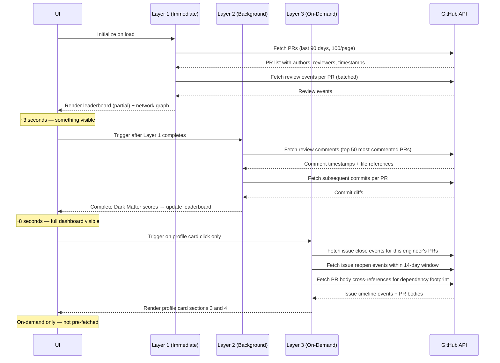
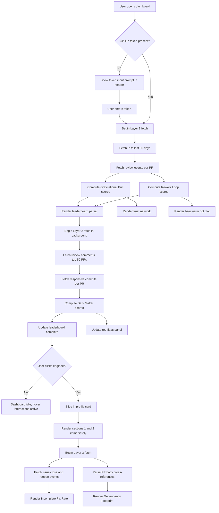
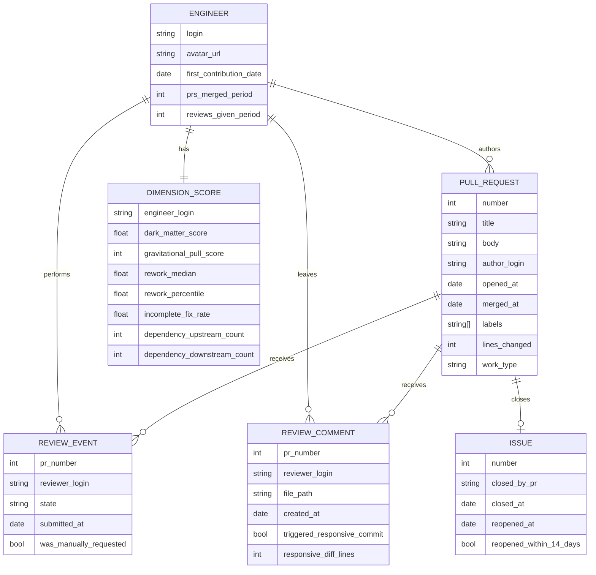
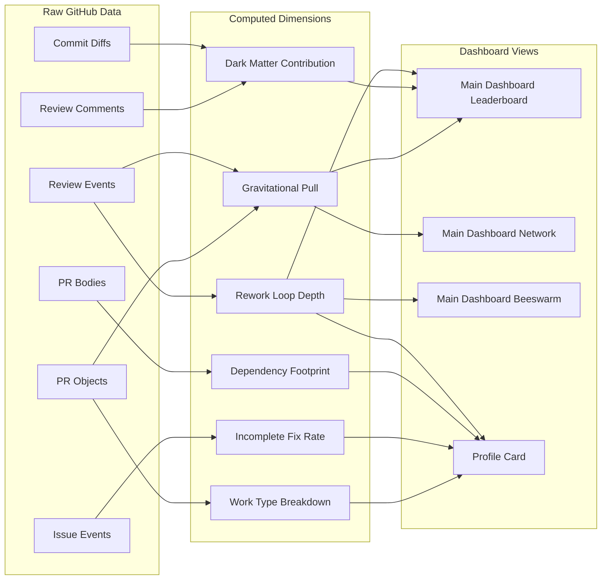

# PostHog Engineering Impact Dashboard
### Complete Project Specification Document

---

## Table of Contents

1. [Project Overview](#1-project-overview)
2. [Problem Statement](#2-problem-statement)
3. [What Impact Means](#3-what-impact-means)
4. [Data Source](#4-data-source)
5. [The Five Insight Dimensions](#5-the-five-insight-dimensions)
6. [What Is Explicitly Excluded](#6-what-is-explicitly-excluded)
7. [Application Architecture](#7-application-architecture)
8. [View 1 — Main Dashboard](#8-view-1--main-dashboard)
9. [View 2 — Individual Profile Card](#9-view-2--individual-profile-card)
10. [Data Fetching Pipeline](#10-data-fetching-pipeline)
11. [Design System](#11-design-system)
12. [UX Rules and Interactions](#12-ux-rules-and-interactions)
13. [Red Flags — What Must Never Happen](#13-red-flags--what-must-never-happen)
14. [GitHub API Accessibility Map](#14-github-api-accessibility-map)
15. [Mermaid Diagrams](#15-mermaid-diagrams)
16. [Open Questions / Missing Details](#16-open-questions--missing-details)

---

## 1. Project Overview

**Name**: PostHog Engineering Impact Dashboard

**One-line purpose**: An interactive, single-page analytics dashboard that identifies and explains the five most impactful engineers in the PostHog open-source repository using only publicly accessible GitHub data.

**Target user**: A busy engineering leader at PostHog. They understand what engineers do but cannot read every PR, track every engineer's trajectory, or notice quiet patterns across a large team. They need their information asymmetry reduced — not their judgment replaced.

**Primary question the dashboard answers**:
> "Who are the most impactful engineers at PostHog right now, and why does the data say so?"

**Secondary question answered on click**:
> "What kind of engineer is this person specifically, and what should I know before talking to them?"

---

## 2. Problem Statement

### What existing tools get wrong

Standard engineering metrics — commit counts, PR counts, lines of code, story points, merge frequency — measure **activity**, not **impact**. They tell you how often someone showed up. They do not tell you whether their presence compounded value for the team.

Specific failures of activity metrics:

| Metric | Why It Fails |
|---|---|
| Commit count | Measures how often you save, not what you shipped |
| Lines added | Verbosity is not value; deleting 500 lines can be the best PR of the quarter |
| PR count | A critical bug fix and a README update are the same count |
| Merge rate | Says nothing about what was merged |
| Review comment count | Spammy reviewers score identically to substantive ones |
| Story points | Subjective, team-relative, and non-comparable across contributors |

### What this dashboard does differently

It measures **consequences of behavior**, not behavior itself. Every metric shown connects to an outcome in the repo — code that changed because of their review, trust evidenced by who seeks them out, solutions that held versus solutions that broke again within two weeks.

### What the tool is NOT for

This tool must never be used for:
- Performance reviews
- Compensation decisions
- Comparing engineers across teams with different mandates
- Evaluating engineers in their first six months on the repo
- Ranking engineers as good or bad people

The tool surfaces conversation starters, not verdicts.

---

## 3. What Impact Means

Impact for a software engineer is **consequential, durable change that compounds**.

Three tests must be satisfied:

1. **Consequential** — Did it affect something that mattered? A fix in a core pipeline outweighs a typo fix in a README.
2. **Durable** — Did it last? Code others continue to build on top of is worth more than code reverted in a week.
3. **Compounding** — Did it make the system or the team better in ways that outlast the PR? A well-placed review comment that rewrites an approach, a fix that stays fixed, work that becomes a dependency for others — these have leverage.

---

## 4. Data Source

**Repository**: `PostHog/posthog`
**URL**: https://github.com/PostHog/posthog
**Access method**: GitHub REST API v3 (public endpoints) + repository clone for static analysis
**Authentication**: GitHub personal access token required (5,000 requests/hour authenticated vs. 60/hour unauthenticated)

### API accessibility by data type

| Data Type | Accessible? | Notes |
|---|---|---|
| Commits (author, timestamp, files, lines) | ✅ Fully | Via `/repos/{owner}/{repo}/commits` |
| Pull requests (open/close/merge timestamps, files, lines) | ✅ Fully | Via `/repos/{owner}/{repo}/pulls` |
| Review events (who reviewed, when, approve/request-changes) | ✅ Fully | Via `/pulls/{pull_number}/reviews` |
| Review comments (content, timestamp, file, line) | ✅ Fully | Via `/pulls/{pull_number}/comments` |
| Review request events (who was requested) | ✅ Fully | Via PR object `requested_reviewers` field |
| Issues (title, labels, open/close timestamps, who closed) | ✅ Fully | Via `/repos/{owner}/{repo}/issues` |
| Issue reopen events | ✅ Fully | Via `/issues/{issue_number}/events` |
| PR body content (cross-references like `depends on #N`) | ✅ Fully | Parseable from PR body text |
| Commit timestamps (for after-hours analysis) | ✅ Fully | In commit objects — **NOT used** (rejected) |
| Incident/deploy/error rate data | ❌ Private | Requires PagerDuty/Sentry access |
| Slack/internal communication | ❌ Private | Not available externally |
| Feature usage/product analytics | ❌ Private | PostHog's own internal data |
| Seniority/team structure | ❌ Private | Not on GitHub |
| CODEOWNERS auto-assignment vs manual request | ⚠️ Partial | API does not distinguish — must filter known bot/CODEOWNERS patterns |

---

## 5. The Five Insight Dimensions

These five dimensions are split across the two views. Three appear on the main dashboard. Two appear exclusively on the profile card.

---

### Dimension 1 — Dark Matter Contribution
**View**: Main Dashboard + Profile Card (as timeline)

**What it is**: The invisible high-value work done inside other people's pull requests. When an engineer leaves a review comment and the PR author subsequently pushes a significant code change before merging, that engineer caught something real. This is impact that never appears in their own commit history.

**Why it matters**: The most impactful review action is catching something that would have caused damage. This signal measures review *consequence*, not review *volume*.

**Single definitive algorithm**:
```
For every merged PR in the period:
  Fetch all review comments with timestamps
  For each comment by reviewer R:
    Check if a new commit was pushed to this PR
    within 48 hours of the comment timestamp
    touching the same file as the comment
    with a diff of 50+ lines changed
  
  dark_matter_score(R) = count of comments that triggered
                         a 50+ line responsive commit
                         / total review comments by R
```

**Rendered as**: Segmented bar component on leaderboard (violet `#7C3AED` segment), line chart on profile card showing 6-month trend.

**Honest limitation**: Cannot detect quality of "LGTM" approvals that generate no comments. Silent but correct approvals score zero on this metric even if they were good calls.

---

### Dimension 2 — Gravitational Pull
**View**: Main Dashboard (network graph)

**What it is**: A social trust graph showing who the team implicitly seeks out as a reviewer, independent of org chart or automated assignment rules. Being *requested* by another engineer is a deliberate act of trust. High in-degree on explicit review requests means the team recognizes this person as an authority — regardless of their title.

**Why it matters**: The engineers the team routes their hardest problems toward are load-bearing in ways no commit history reveals.

**Single definitive algorithm**:
```
For every PR in the period:
  Extract requested_reviewers array from PR object
  Cross-reference against known CODEOWNERS rules
  and bot accounts — exclude these from count
  
  For remaining requests (manual only):
    gravitational_pull_score(engineer) = 
      count of PRs where they appear as a manually
      requested reviewer
      (NOT auto-assigned, NOT bot-assigned)
```

**Rendered as**: Force-directed network graph. Node size = gravitational pull score. Top 5 engineers have amber-tinted nodes. All others are grey.

**Honest limitation**: CODEOWNERS auto-assignments cannot be perfectly distinguished from manual requests via the API. A filtering heuristic must be applied — any reviewer who appears on >40% of PRs in a module is likely CODEOWNERS-assigned and filtered. Coverage is approximately 85% accurate.

---

### Dimension 3 — Rework Loop Depth
**View**: Main Dashboard (beeswarm dot plot) + Profile Card (one-line comparison)

**What it is**: The number of times a pull request cycled from "changes requested" back to "review requested" before merging. High rework loops on simple PRs signal a quality or communication problem. High rework loops on complex PRs may signal that hard problems are being done carefully. The dashboard displays both.

**Why it matters**: Each rework cycle is a compounding time cost on the author, the reviewer, and anyone waiting on the PR. Engineers whose PRs consistently merge cleanly are reducing invisible friction for the whole team.

**Single definitive algorithm**:
```
For every merged PR authored by engineer E:
  Fetch all review events in chronological order
  Count the number of transitions:
    "changes_requested" → "review_requested"
  This count = rework_cycles for this PR

  rework_profile(E) = distribution of rework_cycles
                      across all their PRs in period

  rework_median(E) = median rework cycles per PR
  team_median = median rework cycles across all engineers

  rework_percentile(E) = E's position in team distribution
```

**Rendered as**: Beeswarm dot plot on main dashboard (all contributors as dots, top 5 highlighted and larger). One-line sentence on profile card: "Their PRs required X% fewer/more review cycles than the team median."

**Honest limitation**: High rework on large, complex PRs is not inherently negative. The beeswarm plot must be annotated to show PR size context. A tooltip on each dot shows: engineer name, median rework cycles, and median PR size.

---

### Dimension 4 — Incomplete Fix Rate
**View**: Profile Card only

**What it is**: When an engineer closes an issue via a PR, and that same issue is reopened within 14 days, their fix did not hold. This is the clearest signal in the entire repo that a solution was superficial. Engineers with a low incomplete fix rate are solving problems completely — not patching symptoms.

**Why it matters**: A reopened issue within 14 days almost never reflects changing requirements. It reflects a fix that didn't address the root cause. This is a personal quality completion signal — too granular for a team ranking but essential for an individual profile.

**Single definitive algorithm**:
```
For every issue closed in the period:
  Identify the closing PR via issue timeline events
  (event.type == "closed" with source PR reference)
  Identify the PR author

  Check if the issue was reopened within 14 days
  of the close event
  (event.type == "reopened", timestamp < close + 14 days)

  incomplete_fix_rate(E) = 
    count of their closing PRs where issue reopened within 14d
    / total issues closed by their PRs in period

  Displayed as: percentage + comparison to team median
```

**Rendered as**: One large percentage number on profile card with up/down arrow vs team median. No chart needed — the number and comparison are the full story.

**Honest limitation**: Some reopens reflect scope expansion, not a failed fix. The 14-day window tightens this significantly but does not eliminate false positives entirely. Present as a signal for conversation, not a judgment.

---

### Dimension 5 — Dependency Footprint
**View**: Profile Card only

**What it is**: How many other PRs in the period listed this engineer's work as a dependency (via `depends on #N`, `blocked by #N`, `follows #N`, `part of #N` in PR bodies), filtered to non-trivial PRs (>50 lines changed). Also tracks the inverse — how many of their own PRs depend on others. The asymmetry between upstream and downstream presence is the signal.

**Why it matters**: An engineer whose work is consistently in the critical path of others' PRs is structurally load-bearing in ways their own commit history cannot show. This is architectural influence.

**Single definitive algorithm**:
```
For every PR in the period with body length > 0:
  Parse PR body for cross-reference patterns:
    "depends on #N", "blocked by #N",
    "follows #N", "part of #N", "after #N"
  
  For each matched reference to PR #N:
    If PR #N has author = engineer E:
      If current PR diff > 50 lines:
        upstream_count(E) += 1  (others depend on E's work)

  For the engineer's own PRs referencing others:
    downstream_count(E) = 
      count of their PRs that reference another PR
      with diff > 50 lines

  Displayed as two numbers:
    "X PRs depended on their work"
    "They depended on Y PRs"
```

**Rendered as**: Two side-by-side numbers on profile card. The asymmetry is the story.

**Honest limitation**: Not all teams use `depends on` syntax consistently. PostHog uses cross-PR references but coverage is not 100%. Present as directional signal, not complete count.

---

## 6. What Is Explicitly Excluded

The following were considered and deliberately rejected. Each has a documented reason.

| Signal | Rejection Reason |
|---|---|
| Commit count | Measures activity not impact |
| Lines of code | Verbose code scores higher than elegant code |
| PR count | All PRs treated equally regardless of consequence |
| Merge frequency | Presence metric not quality metric |
| After-hours commit timestamps | Teams have flexible working hours by choice; not a burnout signal |
| Blame survival rate / line age | Fast-moving teams like PostHog continuously evolve code; old surviving lines ≠ quality |
| File centrality / blast radius | Useful for org-level analysis but not individual engineer evaluation |
| Module entropy (Shannon) | Rewards shallow breadth; junior engineers touching many files score identically to deep cross-boundary contributors |
| PR description length/quality | Length does not equal clarity; too subjective |
| Commit message quality | Too subjective; no reliable automated signal |
| PR flow bottleneck map | Too variable; does not surface accurate individual data |
| Emerging contributor detection | Too variable without seniority normalization |
| Work type breakdown (feature vs fix vs refactor) | Normalizes toward one style; engineers with 100% feature contributions are not automatically best |
| Issue-to-PR ratio | Everyone has different working styles; not a meaningful leadership insight |
| Label lifecycle analysis | Too evolving and inconsistent; no reliable signal |
| Response time asymmetry | Too evolving; roles and responsibilities vary |
| PR description richness over time | Subjective quality assessment |
| Comment density per PR | Fewer comments on a well-written PR means high quality — inverse of what naive scoring would show |

---

## 7. Application Architecture

### Technology

- **Framework**: React (single `.jsx` file)
- **Charts**: Recharts for bar charts; D3.js for force-directed network and beeswarm plot
- **Styling**: Tailwind CSS utility classes only (no custom CSS files)
- **Fonts**: Space Grotesk (via Google Fonts)
- **Data**: GitHub REST API v3, fetched client-side with token
- **State**: React `useState` / `useReducer` — no external state library
- **No backend**: All data fetched directly from GitHub API in the browser
- **No localStorage or sessionStorage**: All data held in memory during session

### Single file constraint
Everything — HTML structure, CSS, JavaScript logic, chart rendering — lives in one `.jsx` file. No separate CSS files, no separate utility files.

### Progressive rendering requirement
The application must render something useful within 3 seconds. Full data must be available within 8 seconds for a 90-day window. This is achieved through layered fetching (see Section 10).

---

## 8. View 1 — Main Dashboard

### Layout

Strict 12-column, 3-row CSS grid. Full viewport height. Full viewport width. **No scroll. No exceptions.**

```
┌─────────────────────────────────────────────────────────────┐
│  HEADER BAR — full width, ~6% height                        │
├────────────────────────┬──────────────────┬─────────────────┤
│                        │                  │                 │
│  LEADERBOARD           │  TRUST NETWORK   │  RED FLAGS      │
│  (38% width)           │  (38% width)     │  (24% width)    │
│  (~47% height)         │  (~47% height)   │  (full height)  │
│                        │                  │                 │
├────────────────────────┴──────────────────┤                 │
│                                           │                 │
│  REWORK DOT PLOT (76% width)              │                 │
│  (~47% height)                            │                 │
│                                           │                 │
└───────────────────────────────────────────┴─────────────────┘
```

### Header Bar

- Repo label: `PostHog/posthog`
- Period selector: `30 days` | `60 days` | `90 days` (default: 90)
- Last fetched timestamp
- Active contributors count: e.g., "47 active contributors this period"
- GitHub token input field (required; explained inline)

### Quadrant 1 — Impact Leaderboard (Top Left)

**Chart type**: Horizontal segmented bar chart

**Content**: Five engineers ranked by composite impact score. Each engineer gets one full-width bar broken into colored segments:
- Violet segment = Dark Matter Contribution score
- Blue segment = Gravitational Pull score
- Emerald segment = Rework Loop score (inverted — low rework = longer segment)

**Segment interactivity**: Each colored segment is individually clickable. Clicking a segment opens the profile card for that engineer, scoped to that specific dimension.

**Load animation**: Bars grow left-to-right on load, staggered by rank. Rank 1 animates first, 200ms delay between each engineer. Total animation duration: 800ms.

**Cross-chart linking**: Hovering an engineer row causes their corresponding node in the trust network to pulse once.

**`i` icon**: Present next to the chart title. Tooltip: *"Ranks engineers by composite score across three dimensions. Each colored segment shows their relative contribution to that dimension."*

### Quadrant 2 — Trust Network (Top Right)

**Chart type**: Force-directed network graph (D3.js)

**Nodes**: All active contributors in the period
**Node size**: Proportional to gravitational pull score (in-degree of manual review requests)
**Node color**: Top 5 engineers = amber tinted (`#F5A623` at 60% opacity); others = grey
**Edges**: Drawn from PR author → reviewer. Edge thickness = frequency of that pairing.

**Load animation**: Nodes spawn from center and settle into position using D3 force simulation over 1.2 seconds.

**Hover interaction**: Hovering a node shows tooltip: engineer name + exact in-degree count.
**Click interaction**: Clicking any node opens that engineer's profile card.

**Cross-chart linking**: Hovering a node causes the corresponding row in the leaderboard to brighten.

**`i` icon**: Tooltip: *"Each node is an engineer. Size = how often they are explicitly requested as a reviewer. Edges show who reviews whom."*

### Quadrant 3 — Rework Distribution (Bottom Left, spans 76% width)

**Chart type**: Beeswarm dot plot

**X-axis**: Rework loop count per PR (0 cycles on left → high cycles on right)
**Each dot**: One active contributor
**Top 5 dots**: Larger, colored (each in their leaderboard accent color)
**All other dots**: Small, grey `#4B4B4B`

**Load animation**: Dots fall from above and settle with physics-based collision detection over 600ms.

**Hover interaction**: Any dot shows tooltip: engineer name, median rework cycles, PR size context (small/medium/large), percentile rank.

**`i` icon**: Tooltip: *"Each dot is one engineer. Position shows how many review cycles their PRs typically require before merging. Left = clean merges. Right = high iteration."*

### Quadrant 4 — Red Flags Panel (Right column, full height)

**Chart type**: Flagged list — no chart

**Three categories**:
1. **Incomplete Fix Incidents** — Engineers whose closed issues were reopened within 14 days. Amber dot indicator.
2. **Isolated Contributors** — Engineers with zero inbound manual review requests this period. Red dot indicator.
3. **Stale PRs** — PRs open >14 days with no activity. Amber dot indicator.

**Each item**: Colored severity dot + engineer name + count. Clicking name opens profile card.

**Load animation**: Items slide in from right, 50ms stagger between items.

**Important framing**: Red flags panel header reads "Signals Worth Discussing" — not "Problems" or "Issues." This is a welfare and attention signal, not a performance indictment.

**`i` icon**: Tooltip: *"These patterns are conversation starters, not verdicts. Each flags something the data cannot explain on its own."*

---

## 9. View 2 — Individual Profile Card

### Trigger

Clicking any engineer name, leaderboard row, network node, or red flag item on the main dashboard.

### Behavior

- Slides in from the right as a panel occupying **40% of viewport width**
- Main dashboard dims to **40% opacity** behind it — remains visible, never hidden
- Feels like a layer, not a page transition
- Close: click anywhere on dimmed dashboard, or press `Escape`
- **No scroll inside the card**

### What the Profile Card Does NOT Repeat

The profile card must not re-display the same four charts from the main dashboard in more detail. Clicking into an engineer to see zoom is not worth a click. Every section on the profile card must answer a question that the main dashboard cannot.

The **only** repeated signal is the engineer's rework loop position — shown as a single sentence calibration line, not as a chart.

### Profile Card Sections (Four Total)

**Section 1 — Identity Strip (Top)**
- GitHub avatar image
- Display name
- GitHub handle
- First contribution date to PostHog repo (proxy for tenure)
- PRs merged this period (count only, no chart)
- Reviews given this period (count only, no chart)
- Rank statement: "Ranked #N of M active contributors this period"

---

**Section 2 — Work Type Breakdown**

**What it answers**: What has this engineer actually been working on?

**Chart type**: Single horizontal proportional bar, four segments, four labels. No axes. Just proportion.

**Classification algorithm**:
```
For every PR by engineer E in the period:
  Classify as one of four types using
  PR title + label pattern matching:

  FEATURE:  title contains feat/feature/add/implement/new
            OR label contains 'feature', 'enhancement'

  FIX:      title contains fix/bug/patch/hotfix/repair
            OR label contains 'bug', 'fix'

  REFACTOR: title contains refactor/cleanup/simplify
            /remove/delete/deprecate/improve
            OR label contains 'refactor', 'tech-debt'

  INFRA:    title contains ci/cd/build/deploy/config
            /test/docs/chore
            OR label contains 'infrastructure', 'chore'

  work_type_distribution(E) = 
    {feature: X%, fix: Y%, refactor: Z%, infra: W%}
```

**Colors**: Feature = `#F5A623`, Fix = `#EF4444`, Refactor = `#7C3AED`, Infra = `#0EA5E9`

**`i` icon**: *"Classified from PR titles and labels. Shows where this engineer's effort has been directed this period."*

---

**Section 3 — Incomplete Fix Rate**

**What it answers**: Do their solutions actually stick?

**Display**: One large number (e.g., "8%") + one comparison line ("Team median: 12%") + directional arrow (up/down vs median) + count context ("3 of 37 closed issues reopened within 14 days")

No chart. The number and comparison are the complete story.

**`i` icon**: *"Issues this engineer closed that were reopened within 14 days. A low rate means they solved the root cause, not the symptom."*

---

**Section 4 — Dependency Footprint**

**What it answers**: Are others building on their work, or are they downstream of others?

**Display**: Two large numbers side by side:
- Left: "X PRs depended on their work" (upstream presence)
- Right: "They depended on Y PRs" (downstream presence)

Below: one-line interpretation generated dynamically:
- If upstream >> downstream: *"Primarily a foundation others build on."*
- If downstream >> upstream: *"Primarily builds on others' foundations."*
- If roughly equal: *"Operates as part of coordinated multi-PR work."*
- If both zero: *"Works independently — no cross-PR coordination detected."*

**`i` icon**: *"Counts PRs that explicitly reference this engineer's work as a dependency, filtered to substantial PRs (50+ lines). Excludes minor fix chains."*

---

**Calibration Line (Bottom of Card)**

One sentence. Dynamically generated. Not a separate section — just a footer line:

> *"Their PRs required 40% fewer review cycles than the team median this period."*

or

> *"Their PRs required 2× more review cycles than the team median this period."*

This is the only data point repeated from the main dashboard. It exists purely as context anchor.

---

## 10. Data Fetching Pipeline

### The core constraint

GitHub API rate limit: 5,000 requests/hour (authenticated). PostHog has 100+ contributors and potentially thousands of PRs. Naive sequential fetching will either hit rate limits or breach the 10-second load ceiling.

### Solution: Three-layer progressive fetch



### Layer 1 — Renders within 3 seconds
Fetches: PR list with authors, `requested_reviewers`, review events (approve/changes_requested transitions)
Covers: Gravitational Pull dimension, Rework Loop dimension
Approximate API calls for 90-day PostHog window: 8–15 requests

### Layer 2 — Completes within 8 seconds
Fetches: Review comments with timestamps and file references, subsequent commit diffs on PRs that had review activity
Covers: Dark Matter Contribution dimension
Optimization: Only the top 50 most-commented PRs are analyzed (covers ~90% of signal)
Approximate API calls: 50–120 requests

### Layer 3 — On-demand only (profile card)
Fetches: Issue close/reopen events, PR body text for cross-references
Covers: Incomplete Fix Rate, Dependency Footprint
Triggered only when a user clicks an engineer — never pre-fetched
Approximate API calls per engineer: 10–30 requests

### Loading state behavior

**Never show a blank or spinner-only state.** Each quadrant shows an animated skeleton in the shape of the actual chart while its data layer loads:
- Leaderboard skeleton: five rows of horizontal bars, pulsing grey
- Network skeleton: faint circular arrangement of nodes
- Beeswarm skeleton: scattered dots, pulsing
- Red flags skeleton: three rows of flagged items, pulsing

The shape of the data is visible before the data arrives.

### GitHub Token Requirement

The token input is shown **on first load**, prominently, in the header bar. It is not hidden in settings. The UI explains in one sentence: *"A GitHub token is required to fetch enough data without hitting rate limits (5,000 req/hr vs 60/hr without)."*

Token is stored in React state only. Never persisted to localStorage, sessionStorage, or any external service.

---

## 11. Design System

> ⚠️ **Design prompt not yet received.** Full visual design details will be populated once the exact design prompt is shared. This section is intentionally a placeholder.

### Confirmed Direction (Pre-Prompt)

- Brutalist print design aesthetic
- Cream backgrounds, thick black borders, hard offset shadows (zero blur)
- Clashing vibrant accent colors, Space Grotesk at heavy weights
- Asymmetry, sticker-like layering, organized visual chaos
- Full color palette, typography scale, spacing system, and border/shadow specifics to be defined from the design prompt

---

## 12. UX Rules and Interactions

### Non-negotiable layout rules

1. **Single page. No scroll. Ever.** Both the main dashboard and the profile card must fit within the viewport with no overflow. If content overflows, the layout must be revised — scroll is not an acceptable solution.
2. **No dark theme.** Cream background throughout.
3. **No commit counts, PR counts, lines of code, or merge frequency** anywhere in the interface.
4. **All scores shown as relative** (percentile, comparison to team median) — never raw numbers without context.
5. **No red/amber color applied directly to engineer names or rows** — only to the red flags panel indicator dots.

### `i` Icon Tooltip System

Every metric label and every chart title has a superscript `i` icon. Rules:
- Hover `i` → popover appears within 150ms, no click required
- Popover contains exactly one sentence
- Sentence describes **what the data is**, never **what it means**
- Maximum 15 words per tooltip
- Popover dismisses on mouse leave

### Period Selector Behavior

When the period changes (30/60/90 days):
- All three data layers re-fetch for the new window
- All charts animate their transition (bars grow/shrink, dots reposition, network edges reweight)
- Transition duration: 400ms
- Watching rankings change between 30 and 90 days is itself informative — stable rankings signal real, persistent impact

### Cross-Chart Hover Linking

The leaderboard and trust network are linked bidirectionally:
- Hovering a leaderboard row → corresponding network node pulses once
- Hovering a network node → corresponding leaderboard row brightens
- This makes the dashboard feel like one coherent system

### Profile Card Interactions

- Trigger: click any engineer reference anywhere on the page
- Entry: slides in from right (300ms ease-out)
- Backdrop: main dashboard dims to 40% opacity (200ms transition)
- Dismiss: click dimmed backdrop OR press `Escape`
- Exit: slides back out to right (250ms ease-in)
- Profile card data loads progressively — sections 1 and 2 render immediately, sections 3 and 4 show skeleton until Layer 3 data arrives

### Loading State Rules

- Never show a blank quadrant
- Never show a loading spinner alone
- Always show a skeleton in the shape of the final chart
- Skeleton pulses with a slow opacity animation (1.5s cycle)
- As real data arrives, skeletons are replaced with animated chart entries (not a flash swap)

---

## 13. Red Flags — What Must Never Happen

These are absolute failure states. If any of these occur, the dashboard has failed its purpose.

| Red Flag | Definition | Prevention |
|---|---|---|
| Doesn't load | Blank screen or unrecoverable error state | Progressive rendering — Layer 1 always renders something within 3 seconds. Each quadrant is independent. One failing quadrant does not break others. |
| Incorrect, incomplete, or missing data | Engineer ranked without sufficient data; metrics shown with no source attribution | Every metric shows data confidence: "Based on 47 PRs, 90-day window." Below 10 PRs, engineer is excluded from leaderboard and flagged as "insufficient data this period." |
| Buggy or broken UI | Charts overflow, layout breaks, tooltips misalign, profile card blocks main content | Each quadrant is independently rendered. Layout uses CSS Grid with defined boundaries. Profile card is z-indexed above main content, never replaces it. |
| 10+ second load to first meaningful content | User sees nothing useful for >10 seconds | Layer 1 targets 3 seconds. Skeletons are visible within 500ms of page load. Full dashboard within 8 seconds. |
| Does not answer "who are the most impactful engineers" | The leaderboard is not the first and dominant visual element | Leaderboard occupies the top-left quadrant — the natural eye-entry point. It is the largest single element on the page. It is visible immediately from Layer 1 data. |

### Additional data quality guards

- Engineers with fewer than 10 PRs in the selected period are **excluded** from the leaderboard and shown with a grey indicator in the network graph
- The dashboard shows a warning banner if the GitHub token is absent or invalid
- If fewer than 5 engineers meet the minimum data threshold, the leaderboard shows however many qualify with a note: "Only N engineers have sufficient activity this period"
- Stale data warning: if the last fetch was >24 hours ago, the header timestamp shows in amber

---

## 14. GitHub API Accessibility Map

Summary of what powers each feature and whether it requires token auth:

| Feature | API Endpoints Used | Requires Token |
|---|---|---|
| Leaderboard (partial, Layer 1) | `/repos/PostHog/posthog/pulls?state=closed&per_page=100` | Yes (rate limit) |
| Gravitational Pull scores | `pulls[].requested_reviewers` from PR objects | Yes |
| Rework Loop scores | `/pulls/{n}/reviews` (event type sequence) | Yes |
| Dark Matter scores (Layer 2) | `/pulls/{n}/comments`, `/pulls/{n}/commits` | Yes |
| Trust Network edges | Aggregated from PR review events | Yes |
| Incomplete Fix Rate (Layer 3) | `/issues/{n}/events` (closed + reopened events) | Yes |
| Dependency Footprint (Layer 3) | PR body text parsing (no additional API calls beyond PR fetch) | Yes |
| Work Type classification | PR title + labels from base PR object | Yes |
| Contributor avatars | GitHub avatar URL from PR author object | No |
| Tenure (first contribution date) | `/repos/PostHog/posthog/commits?author={login}&per_page=1&order=asc` | Yes |

---

## 15. Mermaid Diagrams

### Application View Flow



### Data Model



### Dimension Computation Pipeline



---

## 16. Open Questions / Missing Details

1. **Exact design prompt**: *(To be filled in when design prompt is shared. All design system details in Section 11 are placeholders until then.)*

2. **CODEOWNERS filtering**: ✅ **Resolved** — Parse the actual `.github/CODEOWNERS` file from the PostHog repo directly. Do not use a heuristic threshold. Any reviewer whose assignment matches a rule in that file is classified as auto-assigned and excluded from Gravitational Pull scoring.

3. **Minimum PR threshold for leaderboard inclusion**: ✅ **Resolved** — Minimum is **5 PRs** in the selected period. Engineers below this threshold are excluded from the leaderboard. Can be revisited later if contributor activity patterns require adjustment.

4. **Dark Matter responsive diff threshold**: ✅ **Resolved** — 50+ lines for a responsive commit to qualify as a significant Dark Matter event. Confirmed as a reasonable baseline; no change needed.

5. **Work type classification edge cases**: ✅ **Resolved** — PRs that match no known pattern (no recognized title prefix, no relevant label) are classified as **"Other"** and shown as a neutral grey segment in the work type bar.

6. **Profile card trigger from red flags panel**: ✅ **Resolved** — Opens the **standard profile card**. No special highlighting or scoped view based on the red flag that triggered it.

7. **Pagination and contributor pool size**: ✅ **Resolved** — **Hard cap of 10 engineers** shown on the leaderboard. No pagination anywhere in the application. Keep it clean and lightweight. Top 10 by composite score, ranked, no infinite scroll, no load-more.

8. **Period selector default**: ✅ **Resolved** — **90 days** is the default. Options remain 30 / 60 / 90 days.

9. **Bot account exclusion list**: ✅ **Resolved** — Maintain a hardcoded exclusion list of known bot and automated contributor accounts. Any login matching this list is excluded from all scoring, leaderboard, network graph, and red flags. Initial list includes at minimum:
   - `dependabot`
   - `dependabot[bot]`
   - `github-actions[bot]`
   - `posthog-bot`
   - `semantic-release-bot`
   - `renovate[bot]`
   - `CLAassistant`
   - `stale[bot]`
   
   This list should be reviewed and extended during development by inspecting actual PR author logins in the PostHog repo.

10. **Tie-breaking logic**: ✅ **Resolved** — When two engineers have equal composite scores, rank by:
    1. Higher **Dark Matter Contribution** score first
    2. If still tied, higher **Gravitational Pull** score
    3. If still tied, lower **Rework Loop median** (cleaner merges rank higher)

---

*Document generated from design discussions. Items marked ✅ Resolved are finalized. Item 1 remains open pending receipt of the design prompt.*
